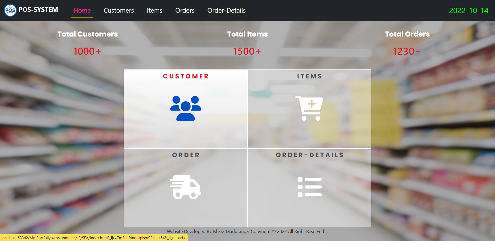
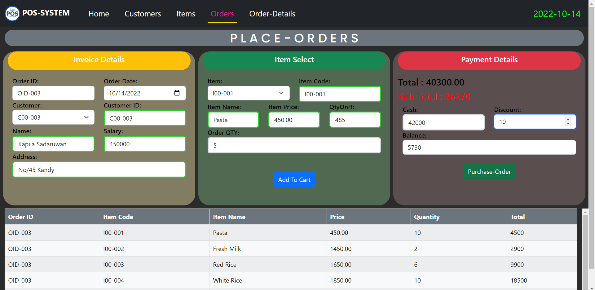
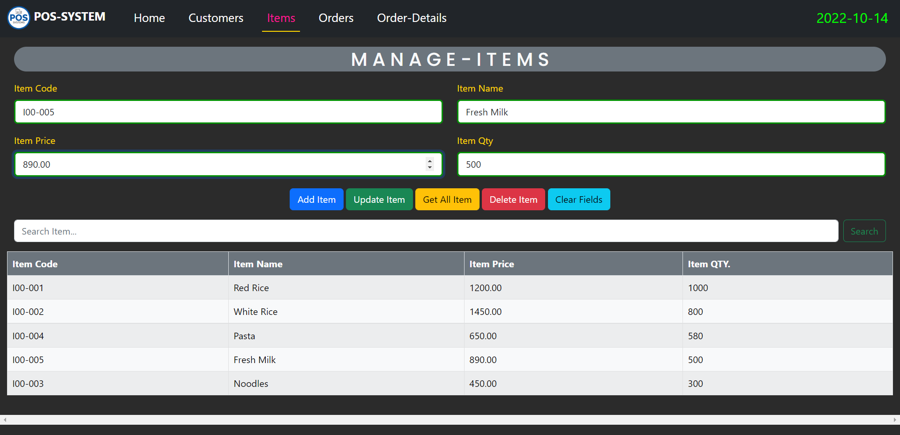
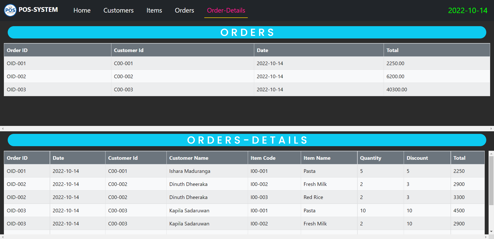

# Spring_Pos-Maven-Project
 
<h5 align="center">
𝚃𝚑𝚊𝚗𝚔 𝚈𝚘𝚞 𝙵𝚘𝚛 𝚈𝚘𝚞𝚛 𝙲𝚘𝚖𝚒𝚗𝚐 this Repository 😍😍😍 
𝙷𝚊𝚟𝚎 𝚊 nice 𝚍𝚊𝚢 ! 
	
</h5>

#### Also,This website Optimized to Provide for All Mobile & Desktop Devices Can View

## :link: Reference Links

🌱 Moke-Up-URL ---> [Click Me!](https://www.figma.com/file/kJ5dbaCDIMbBH6S3eyZJwM/POS_System(Bootstrap)?node-id=0%3A1) 
🌱 Site-Map-URL----> [Click Me!](https://www.gloomaps.com/3XQDYVDqdC) 
🌱 Wire-Frame-URL----> [Click Me!](https://wireframe.cc/9oCnTI) 

## Technology /framework used
* Spring(Web MVC)
* Java
* Servlets
* Hibernate
* Maven
* HTML
* CSS
* Java Script
* Bootstrap-V5.2
## ✔ Description
#### This website designs for showing some proceed of web pos system.I categorize them into few Functionlities ...
### Manage Customer
* Register Customer
* Unregister Customer
* Find Customer
* Update Customer
* Get All Customers

### Manage Store
* Add Items
* Remove Items
* Search Items
* Update Items
* Get All Items

### Place Order
* Save a Customer Order
* Search Customer Order;
* Update Customer Order
* Delete Customer Order;
* Get All Customers Order

## Basic Background of Pos_System

### 🌱 DashBoard Interface

### 🌱 Place Order Manage Interface

### 🌱 Customers Manage Interface

### 🌱 Items Manage Interface

### 🌱 Order-Details Interface

## License
**Copyright @ 2022 Web_Pos_System All Right Reserved By Ishara Maduranga**

